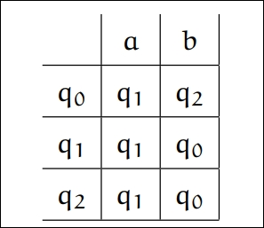
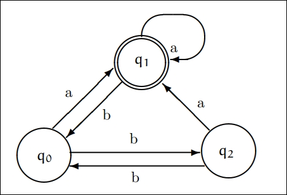

``` toc
```
---
# Alfabeti e Linguaggi
Alcune definizioni.
-   _Simbolo_: entità primitiva astratta che non è formalmente definita
-   _Stringa_ (o _parola_): una sequenza finita di simboli giustapposti (uno dietro l’altro)    
-   _Lunghezza_ di una stringa $w$: si denota con $|w|$ ed è il numero di _occorrenze_ di simboli che compongono una stringa. La stringa vuota, costituita da zero simboli, si denota con $\epsilon$ e $|\epsilon| = 0$.


La _concatenazione_ di due stringhe $v, w$ è la stringa $vw$ che si ottiene facendo seguire alla prima la seconda; è un’operazione associativa.

Un **alfabeto** $\mathbf{\Sigma}$ è un insieme finito di simboli. Un _linguaggio formale_ è un insieme di stringhe costruite a partire dai simboli di un alfabeto $\Sigma$. $\mathbf{\Sigma^*}$ indica l’insieme di tutte le stringhe generabili a partire da un fissato alfabeto $\Sigma$ (l’asterisco si chiama _stella di Kleene_).

# Automi
Un **automa a stati finiti** è un modello matematico di un sistema avente *input*,
ed eventualmente *output*, a valori discreti. Il sistema può essere in uno stato tra un
insieme finito di stati possibili. L’essere in uno stato gli permette di tener traccia
della storia precedente.

Il comportamento dell’automa si definisce in maniera univoca mediante una tabella, detta **matrice di transizione**, come ad esempio:


Con la rappresentazione tramite grafo:


## Automi deterministici
Un **automa a stati finiti deterministico** (DFA) è una quintupla $\langle Q,\,\Sigma,\,\delta,\,q_0,\,F \rangle$ dove:
- $Q$ è un insieme finito di *stati*;
- $\Sigma$ è un alfabeto (di input)
- $\delta : Q \times \Sigma \longrightarrow Q$ è la *funzione di transizione* 
- $q_0$ lo stato iniziale
- $F \subseteq Q$ è l'*insieme degli stati finali*.

Tramite la funzione di transizione $\delta$ è possibile definire l'analoga $\hat{\delta}$ che opera direttamente su una stringa e restituisce lo stato finale dell'elaborazione:
$$
\left\{\begin{array}{ll}
	\hat{\delta}\left({q,\,\epsilon}\right) &= q \\
	\hat{\delta}\left({q,\,wa}\right) &= \delta\left({\hat{\delta}\left({q,w}\right),\,a}\right)
\end{array}\right.
$$
o analogamente
$$
\left\{\begin{array}{ll}
	\hat{\delta}\left({q,\,\epsilon}\right) &= q \\
	\hat{\delta}\left({q,\,aw}\right) &= \hat{\delta}\left( {\delta\left({q,a}\right),\,w} \right)
\end{array}\right.
$$
Il *linguaggio accettato* da un DFA $\mathcal{M}$ è l'insieme delle stringhe accettate e si denota con $L(\mathcal{M})$.
Un linguaggio è detto **regolare** se è accettato da qualche DFA, ovvero se esiste $\mathcal{M}$ tale che $L = L(\mathcal{M})$. 

> $\varnothing$ e $\Sigma^*$ sono linguaggi regolari.  

## Automi a stati finiti non deterministici
Un **automa a stati finiti non deterministici** (NFA) presenta la stessa struttura vista per i DFA, eccetto per la *funzione di transizione*:
$$ 
	\delta : Q \times \Sigma \longrightarrow \mathcal{P}{(Q)}
$$
Infatti, ora il codominio di $\delta$ è *l'insieme delle parti di Q*; pertanto essa calcola, a partire da una coppia (*stato*, *simbolo*), <mark style="background: #FF5582A6;">un insieme di stati</mark> risultante. Si noti che ora è possibile $\delta({q,\,a}) = \varnothing$ per qualche $q \in Q$ ed $a \in \Sigma$ (in questo caso la computazione si arresta).

Anche in questo caso si può definire
$$
\left\{\begin{array}{ll}
	\hat{\delta}\left({q,\,\epsilon}\right) &= \{q\} \\
	\hat{\delta}\left({q,\,wa}\right) &= 
	\bigcup_{p \in \hat{\delta}({q,\,w})}{\delta{(p,\,a)}}
\end{array}\right.
$$
Una stringa $x$ è accettata da un NFA $\mathcal{M}$ se $\hat{\delta}{(q_0,\,x)} \cap F \neq \varnothing$, ovvero se nell'insieme risultante dalla computazione c'è <mark style="background: #FFB86CA6;">almeno uno stato accettante</mark>.
Il *linguaggio accettato* da $\mathcal{M}$ è l'insieme delle stringhe accettate, ovvero che godono della precedente proprietà.

## Equivalenza tra DFA e NFA
Dimostriamo che i linguaggi accettati dai DFA e dagli NFA coincidono.

### DFA $\mathbb\Rightarrow$ NFA
Questo lato dell'implicazione è banale; infatti un DFA si può vedere come un NFA in cui per ogni simbolo $a \in \Sigma$ si ha 
$$
	\delta({q,\,a}) = \{a\}
$$
ovvero la funzione di transizione per NFA restituisce sempre insiemi singoletti.

### NFA $\mathbb\Leftarrow$ DFA
L'altra implicazione è dimostrata dal **Teorema di Robin-Scott**:

==TODO: teorema==

==TODO: automi con $\epsilon$ transizioni==