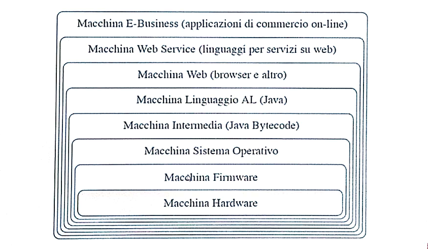

# Macchine astratte
```toc
```
---

## Linguaggi
Esistono diverse tipologie di linguaggi:
- [Linguaggi imperativi](#linguaggi%20imperativi)
- [Linguaggi dichiarativi](#linguaggi%20dichiarativi)
- [Linguaggi funzionali](#linguaggi%20funzionali)
- [Linguaggi logici](#linguaggi%20logici%20e%20con%20vincoli)
- [Linguaggi orientati agli oggetti](#linguaggi%20orientati%20agli%20oggetti)

### Linguaggi imperativi
- Basati sulla nozione di stato (insieme di locazioni di memoria contenenti dei valori).
- Le istruzioni sono comandi che cambiano lo stato. 
- Ad esempio: $X:= X+1$; $X:= X+2$; ...
- C, Pascal, FORTRAN, COBOL, ...
- Analogia con le frasi imperative dove il soggetto è implicito (e.g. taglia quella mela).

### Linguaggi dichiarativi
- Basati sulla nozione di funzioni o relazione.
- Le istruzioni sono dichiarazioni di nuovi valori, in modo diretto oppure per composizione di funzioni o relazioni.
- Ad esempio: $(fun(X). X+2) 3;$
- Analogia con le frasi dichiarative (quella mela è tagliata)

### Linguaggi funzionali
- Basati sulla nozione di funzione: il risultato del programma è il valore esplicito di una espressione.
- Applicazione e definizione di funzioni, ricorsione 
- Programmare vuol dire costruire la funzione che calcola il risultato
- Lisp, Scheme, ML, Haskell

### Linguaggi logici (e con vincoli)
- Basati su relazioni: il risultato è il valore di alcune variabili determinato da alcune relazioni.
- Le Istruzioni sono implicazioni logiche fra opportune formule, che possono essere viste come regole di riscrittura.
- Programmare vuol dire specificare la relazione che definisce li valore delle variabili di interesse (sostanzialmente "dire come è fatta la soluzione").
- Prolog, CLP

### Linguaggi orientati agli oggetti
- Linguaggi imperativi con alcune metodologie di progettazione dichiarative.
- Oggetti (istanze di opportune classi) che contengono idati (concetti imperativi) e metodi come funzioni per operare su tali oggetti (concetti dichiarativi).
- Incapsulamento 
- Ereditarietà

_[Torna all'indice](#macchine%20astratte)_

---

## Nozione di macchina astratta e interprete
Il termine "macchina" si riferisce alla macchina calcolatore. Una macchina astratta è un'astrazione del concetto di calcolatore fisico.  

Gli algoritmi che vogliamo eseguire devono essere rappresentati mediante le istruzioni di un opportuno linguaggio di programmazione $L$, linguaggio che sarà definito formalmente da una specifica sintassi e da una precisa semantica.

Un programma $L$ (o un programma scritto in $L$) è un insieme finito di istruzioni di $L$.


### Definizione (Macchina Astratta)
Supponiamo che sia dato un linguaggio di programmazione $L$. Definiamo una macchina astratta per $L$, e la indichiamo con $M_L$ , un qualsiasi insieme di strutture dati e di algoritmi che permettono di memorizzare ed eseguire programmi scritti in $L$.

Una generica macchina astratta $M_L$ è composta da una _memoria_ e da un _interprete_.
La memoria serve per immagazzinare dati e programmi, mentre l'interprete è il componente che esegue le istruzioni contenute nei programmi.

### Interprete
L'interprete dovrà compiere delle operazioni specifiche che dipendono dal particolare linguaggio $L$ che deve essere interpretato.
L'interprete esegue diversi tipi di operazioni:
1. Operazioni per l'elaborazione dei dati primitivi
2. Operazioni e strutture dati per il controllo della sequenza di esecuzione delle operazioni
3. Operazioni e strutture dati per il controllo del trasferimento dei dati
4. Operazioni e strutture dati per la gestione della memoria
==TODO: fare approfondimento==


_[Torna all'indice](#macchine%20astratte)_

### Definizione (Linguaggio macchina)
Data una macchina astratta $M_L$ , il linguaggio $L$ "compreso" dall'interprete di $M_L$ è detto linguaggio macchina di $M_L$.

I programmi scritti nel linguaggio macchina di $M_L$ saranno memorizzati nelle strutture di memoria della macchina in modo tale da essere distinti dagli altri dati primitivi sui quali opera l'interprete.


### L'esempio della Macchina Hardware
Come primo esempio di macchina astratta vediamo il caso di una macchina hardware: chiameremo $MH_{LH}$ tale macchina e $LH$ il suo linguaggio macchina.

I componenti di questa macchina astratta saranno:
- _Memoria:_ è la componente di memorizzazione della macchina fisica. È composta da vari livelli: principale, secondaria e cache.
- _Linguaggio $LH$:_ è costituito da istruzioni relativamente semplici. Ad esempio `ADD R5, R0` indica la somma del contenuto dei registri `R0` e `R5` e la memorizzazione del risultato in `R5`.
- _Interprete:_ è colui che si occupa di eseguire il ciclo `fetch-decode-execute`. ==(TODO: fare approfondimento)==

_[Torna all'indice](#macchine%20astratte)_

---

## Implementazione di un linguaggio
Una macchina astratta $M_L$ è per definizione un dispositivo che permette di eseguire programmi scritti in $L$. 
Una macchina astratta corrisponde univocamente ad un linguaggio. 
Inversamente, dato un linguaggio di programmazione $L$, vi sono molte (infinite) macchine astratte che hanno $L$ come proprio linguaggio macchina.
Tali macchine differiscono tra loro nel modo in cui l'interprete è realizzato e nelle strutture dati che utilizzano, mentre tutte coincidono nel linguaggio interpretato $L$.

### Microprogrammazione
==TODO: da approfondire==

_[Torna all'indice](#macchine%20astratte)_

---

## Realizzazione di una macchina astratta
Una qualsiasi macchina astratta $M_L$ per essere effetttivamente realizzata dovrà **prima o poi utilizzare** qualche dispositivo fisico per eseguire le istruzioni di $L$.

Possiamo realizzare una macchina astratta:
1. Realizzazione in hardware: viene usata solo per macchine di basso livello; massima velocità, flessibilità nulla.
2. Emulazione mediante firmware: strutture dati e algoritmi realizzati da microprogrammi; alta velocità, flessibilità maggiore che hardware puro.
3. Simulazione mediante software: strutture dati e algoritmi realizzati da programmi; minore velocità, massima flessibilità, macchina ospite qualsiasi.

Nella realtà, la macchina astratta viene realizzata su di una macchina fisica mediante una combinazione delle tre tecniche sopra citate.

_[Torna all'indice](#macchine%20astratte)_

### Implementazione: il caso ideale
Consideriamo un generico linguaggio $L$ che si vuole implementare, ovvero di cui si vuole realizzare una macchina astratta $M_L$. 
Escludendo una realizzazione diretta di $M_L$ in hardware, possiamo supporre di avere a disposizione, per la realizzazione di $M_L$ , una macchina astratta $Mo_Lo$  (macchina ospite), che è già stata realizzata e che quindi ci permette di usare direttamente i suoi costrutti del suo linguaggio macchina $Lo$.

L'implementazione di $L$ sulla macchina ospite $Mo_Lo$ avviene mediante una qualche "traduzione" di $L$ in $Lo$. 
Possiamo distinguere due modalità di implementazione concettualmente molto diverse:
- Implementazione interpretativa pura
- Implementazione compilativa pura

_[Torna all'indice](#macchine%20astratte)_

### Implementazione interpretativa pura
Nell'implementazione interpretativa pura si realizza l'interprete di $M_L$ mediante un insieme di istruzioni in $Lo$. Quindi $M_L$ è realizzata scrivendo un interprete per $L$ su $Mo_Lo$.

Dunque non vi è una traduzione esplicita dei programmi scritti in $L$, ma vi è solo un procedimento di "decodifica". Tale decodifica non è una traduzione esplicita perchè il codice corrispondente ad un'istruzione di $L$ viene eseguito, non prodotto in uscita dall'interprete.

Svantaggi: scarsa efficienza dato che non vi è una fase preliminare di traduzione (tempi di esecuzione raddoppiati: operazioni + decodifica).
Vantaggi: maggiore flessibilità.


### Implementazione compilativa pura
Nell'implementazione compilativa pura l'implementazione di di $L$ avviene traducendo esplicitamente i programmi scritti in $L$ in programmi scritti in $Lo$. La traduzione è eseguita da un opportuno programma, detto _compilatore_ $C_{L,Lo}$.

In questo contesto il linguaggio $L$ è detto comunemente _linguaggio sorgente_, mentre il linguaggio $Lo$ è il _linguaggio oggetto_.

I vantaggi e gli svantaggi sono gli opposti dell'implementazione interpretativa pura.

Inoltre uno degli svantaggi maggiori dell'approccio compilativo risiede nella perdita di informazioni riguardo alla struttura del programma sorgente, perdita che rende più difficile l'interazione con il programma a tempo di esecuzione.
Ad esempio, se a run-time si verificasse un errore potrebbe essere difficile determinare qual è il comando del programma sorgente che lo ha determinato, visto che tale comando è stato compilato in una sequenza di istruzioni del linguaggio oggetto. In questo caso può essere più difficile realizzare sistemi di debugging.


### Implementazione: nel caso reale
Nelle implementazioni dei linguaggi reali sono quasi sempre preseti entrambe le componenti.
Un esempio è _Java_.


_[Torna all'indice](#macchine%20astratte)_

---

## Gerarchia di macchine astratte
Un'architettura informatica (hardware o software) si strura in una serie di macchine astratte gerarchiche.

Sia $M_i$ una macchina astratta:
- $M_i$ usa i servizi forniti da $M_{i-1}$ (il linguaggio $L_{M_{i+1}}$)
- $M_i$ fornisce servizi a $M_{i+1}$ (interpreta $L_{M_{i+1}}$)
- $M_i$ nasconde (entro certi limiti) la macchina $M_{i-1}$

Di seguito troviamo una gerarchia tipica di una web application:


_[Torna all'indice](#macchine%20astratte)_

---

## Sommario
* La ___macchina astratta___: una formalizzazione astratta di un generico esecutore di algoritmi, formalizzati in ternini di uno specifico linguaggio di programmazione.
- L'___interprete___: un componente essenziale della macchina astratta che ne caratterizza il comportamento, mettendo in relazione "operazionale" il linguaggio della macchina astratta col mondo fisico circostante.
- Il ___linguaggio macchina___: il linguaggio di una generica macchina astratta.
- Varie tipologie di linguaggi: caratterizzate dalla distanza dalla macchina fisica. 
- L'___implementazione di un linguaggio___: nelle sue varie modalità, da quella puramente interpretativa a quella puramente compilativa; la nozione di compilatore è qui particolannente importante.
- La nozione di ___macchina intermedia___: essenziale nell'implementazione reale di un qualsiasi linguaggio, nota soprattutto in alcuni casi "famosi" (macchina P-code per Pascal e Java Virtual Machine).
- ___Gerarchie di macchine astratte___: le macchine astratte si possono comporre gerarchicamente e molti sistemi software possono essere visti in questi termini.

_[Torna all'indice](#macchine%20astratte)_