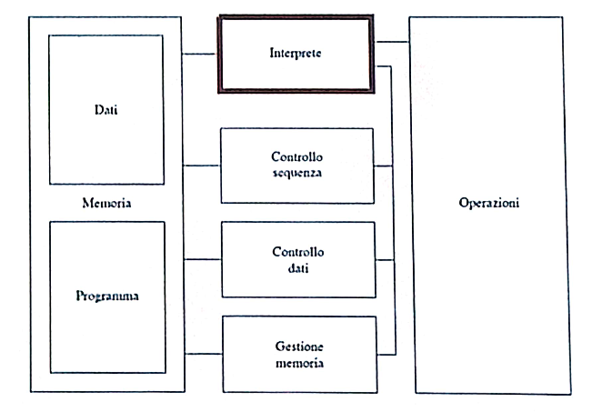
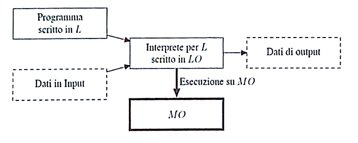
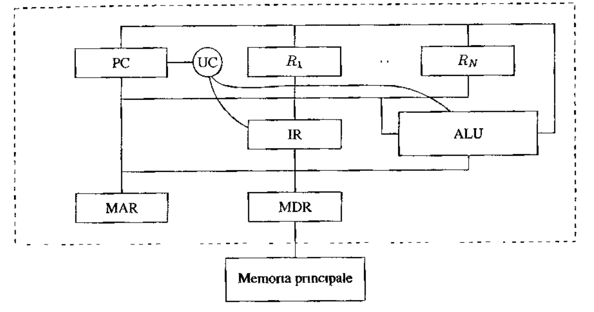
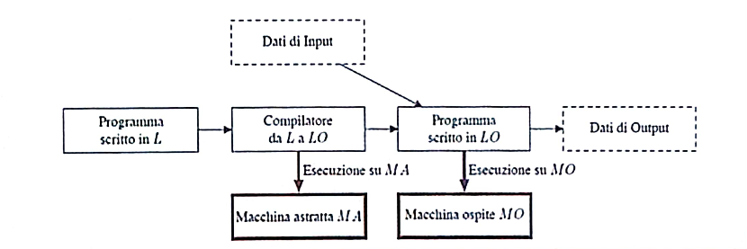
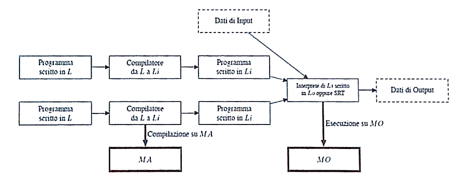

# Macchine astratte
==TODO: indice e ritorna all'indice==
==TODO: mettere immagini al centro e non a sinistra==

# Linguaggi
==TODO: da fare==
linguaggi imperativi, dichiarativi, funzionali, logici, orientati agli oggetti

# Nozione di macchina astratta e interprete
Il termine "macchina" si riferisce alla macchina calcolatore. Una macchina astratta è un'astrazione del concetto di calcolatore fisico.  

Gli algoritmi che vogliamo eseguire devono essere rappresentati mediante le istruzioni di un opportuno linguaggio di programmazione $L$, linguaggio che sarà definito formalmente da una specifica sintassi e da una precisa semantica.

Un programma $L$ (o un programma scritto in $L$) è un insieme finito di istruzioni di $L$.

## _Definizione (Macchina Astratta)_
Supponiamo che sia dato un linguaggio di programmazione $L$. Definiamo una macchina astratta per $L$, e la indichiamo con $M_L$ , un qualsiasi insieme di strutture dati e di algoritmi che permettono di memorizzare ed eseguire programmi scritti in $L$.

Una generica macchina astratta $M_L$ è composta da una _memoria_ e da un _interprete_.
La memoria serve per immagazzinare dati e programmi, mentre l'interprete è il componente che esegue le istruzioni contenute nei programmi.

## Interprete
L'interprete dovrà compiere delle operazioni specifiche che dipendono dal particolare linguaggio $L$ che deve essere interpretato.
L'interprete esegue diversi tipi di operazioni:
1. Operazioni per l'elaborazione dei dati primitivi
2. Operazioni e strutture dati per il controllo della sequenza di esecuzione delle operazioni
3. Operazioni e strutture dati per il controllo del trasferimento dei dati
4. Operazioni e strutture dati per la gestione della memoria
==TODO: fare approfondimento==

## _Definizione (Linguaggio macchina)_
Data una macchina astratta $M_L$ , il linguaggio $L$ "compreso" dall'interprete di $M_L$ è detto linguaggio macchina di $M_L$.

I programmi scritti nel linguaggio macchina di $M_L$ saranno memorizzati nelle strutture di memoria della macchina in modo tale da essere distinti dagli altri dati primitivi sui quali opera l'interprete.

## L'esempio della Macchina Hardware
Come primo esempio di macchina astratta vediamo il caso di una macchina hardware: chiameremo $MH_LH$  ==(TODO da sistemare pedice)== tale macchina e $LH$ il suo linguaggio macchina.

I componenti di questa macchina astratta saranno:
- _Memoria:_ è la componente di memorizzazione della macchina fisica. È composta da vari livelli: principale, secondaria e cache.
- _Linguaggio $LH$:_ è costituito da istruzioni relativamente semplici. Ad esempio `ADD R5, R0` indica la somma del contenuto dei registri `R0` e `R5` e la memorizzazione del risultato in `R5`.
- _Interprete:_ è colui che si occupa di eseguire il ciclo `fetch-decode-execute`. ==(TODO: fare approfondimento)==

# Implementazione di un linguaggio
Una macchina astratta $M_L$ è per definizione un dispositivo che permette di eseguire programmi scritti in $L$. 
Una macchina astratta corrisponde univocamente ad un linguaggio. 
Inversamente, dato un linguaggio di programmazione $L$, vi sono molte (infinite) macchine astratte che hanno $L$ come proprio linguaggio macchina.
Tali macchine differiscono tra loro nel modo in cui l'interprete è realizzato e nelle strutture dati che utilizzano, mentre tutte coincidono nel linguaggio interpretato $L$.

## Microprogrammazione
==TODO: da approfondire==

## Realizzazione di una macchina astratta
Una qualsiasi macchina astratta $M_L$ per essere effetttivamente realizzata dovrà **prima o poi utilizzare** qualche dispositivo fisico per eseguire le istruzioni di $L$.

Possiamo realizzare una macchina astratta:
1. Realizzazione in hardware: viene usata solo per macchine di basso livello; massima velocità, flessibilità nulla.
2. Emulazione mediante firmware: strutture dati e algoritmi realizzati da microprogrammi; alta velocità, flessibilità maggiore che hardware puro.
3. Simulazione mediante software: strutture dati e algoritmi realizzati da programmi; minore velocità, massima flessibilità, macchina ospite qualsiasi.

Nella realtà, la macchina astratta viene realizzata su di una macchina fisica mediante una combinazione delle tre tecniche sopra citate.

## Implementazione: il caso ideale
Consideriamo un generico linguaggio $L$ che si vuole implementare, ovvero di cui si vuole realizzare una macchina astratta $M_L$. 
Escludendo una realizzazione diretta di $M_L$ in hardware, possiamo supporre di avere a disposizione, per la realizzazione di $M_L$ , una macchina astratta $Mo_Lo$  (macchina ospite), che è già stata realizzata e che quindi ci permette di usare direttamente i suoi costrutti del suo linguaggio macchina $Lo$.

L'implementazione di $L$ sulla macchina ospite $Mo_Lo$ avviene mediante una qualche "traduzione" di $L$ in $Lo$. 
Possiamo distinguere due modalità di implementazione concettualmente molto diverse:
- Implementazione interpretativa pura
- Implementazione compilativa pura

### Implementazione interpretativa pura
Nell'implementazione interpretativa pura si realizza l'interprete di $M_L$ mediante un insieme di istruzioni in $Lo$. Quindi $M_L$ è realizzata scrivendo un interprete per $L$ su $Mo_Lo$.

Dunque non vi è una traduzione esplicita dei programmi scritti in $L$, ma vi è solo un procedimento di "decodifica". Tale decodifica non è una traduzione esplicita perchè il codice corrispondente ad un'istruzione di $L$ viene eseguito, non prodotto in uscita dall'interprete.

Svantaggi: scarsa efficienza dato che non vi è una fase preliminare di traduzione (tempi di esecuzione raddoppiati: operazioni + decodifica).
Vantaggi: maggiore flessibilità.

### Implementazione compilativa pura
Nell'implementazione compilativa pura l'implementazione di di $L$ avviene traducendo esplicitamente i programmi scritti in $L$ in programmi scritti in $Lo$. La traduzione è eseguita da un opportuno programma, detto _compilatore_ $C_L,Lo$. ==(TODO da sistemare pedice)==

In questo contesto il linguaggio $L$ è detto comunemente _linguaggio sorgente_, mentre il linguaggio $Lo$ è il _linguaggio oggetto_.

I vantaggi e gli svantaggi sono gli opposti dell'implementazione interpretativa pura.

Inoltre uno degli svantaggi maggiori dell'approccio compilativo risiede nella perdita di informazioni riguardo alla struttura del programma sorgente, perdita che rende più difficile l'interazione con il programma a tempo di esecuzione.
Ad esempio, se a run-time si verificasse un errore potrebbe essere difficile determinare qual è il comando del programma sorgente che lo ha determinato, visto che tale comando è stato compilato in una sequenza di istruzioni del linguaggio oggetto. In questo caso può essere più difficile realizzare sistemi di debugging.

### Implementazione: nel caso reale
Nelle implementazioni dei linguaggi reali sono quasi sempre preseti entrambe le componenti.
Un esempio è _Java_.

# Gerarchia di macchine astratte
==TODO: da fare (pag21)==

# Sommario
==TODO: da fare (pag24)==